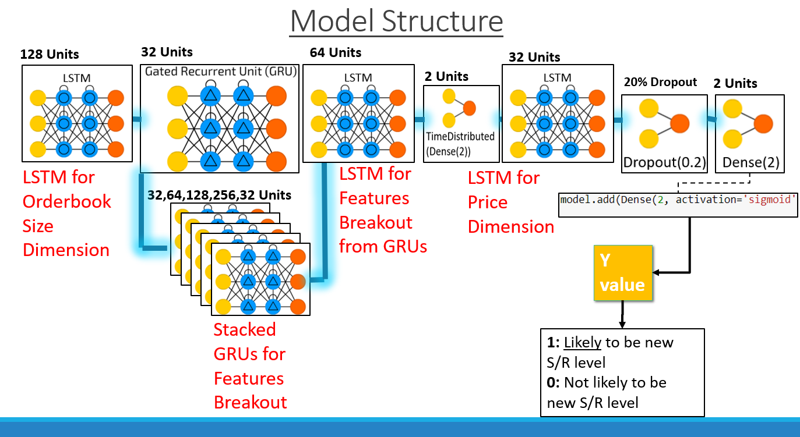
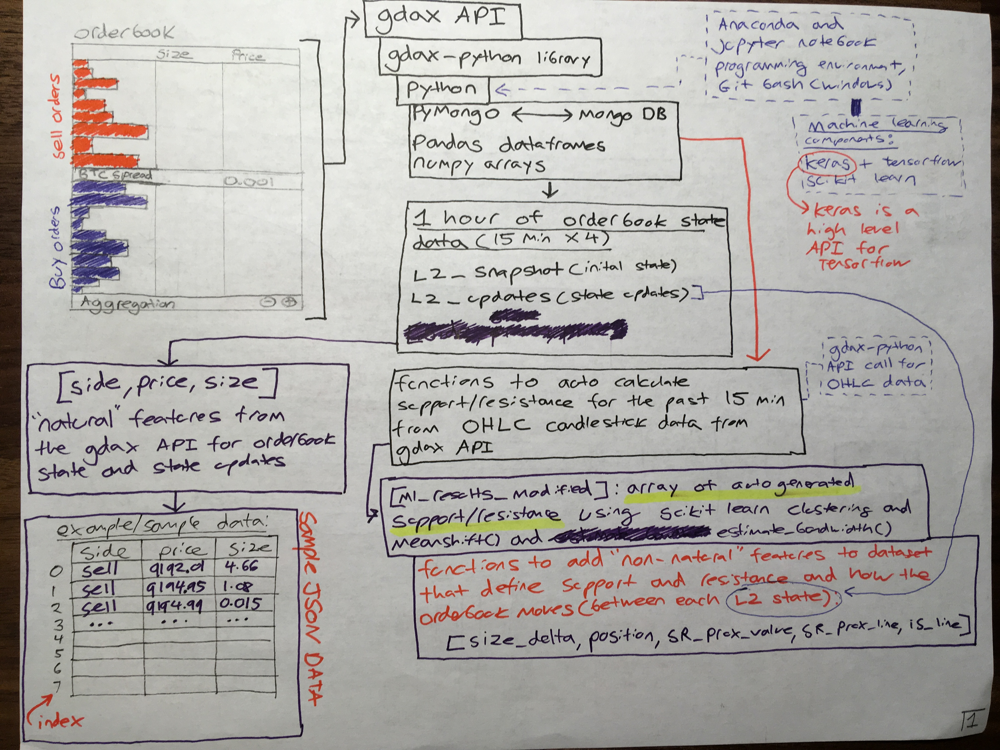

# gdax-orderbook-ml
Application of machine learning to the GDAX orderbook using a stacked bidirectional LSTM/GRU model to predict new support and resistance on a 15-minute basis; Currently under heavy development. 

**Model Structure (visual):**

**General project API/data structure:**

## Project/File Structure

<u>Latest notebook file(s) with project code:</u>

**9_data_pipeline_development.ipynb**:

- Development of data pipelines and optimization of data from MongoDB instance to ML model pretraining

- Development groundwork for automation pipeline for automated hourly data scrape, cycling, and training for model through segregated instance or live online-based model

- Removal of deprecated packages + base package version upgrade (i.e. Pandas)

  ​

**8_program_structure_improvement.ipynb**:
- Even further refinement to program structure
    - Function scope and structure & function creation for common operations
    - Parsing of raw data into 4 seperate l2 update (4 consecutive 15 minute l2update segements)
- Machine learning model refinement & training + model structure updates
- Refinement of data storage format/file type 
    - Researching/testing implementations to move away from .csv due to file I/O limitations:
        - Research into Pickle/h5py/msgpack/feather to saving dataframe contents to disk is underway
- *Currently broken*:
    - API calls from the gdax-python API for candlestick data for the first timestamp of each l2update_15min file (1 hour of l2 updates split into four 15-minute increments) currently not working
    - Implementation of historical candlestick/OHLC data from 'gdax-ohlc-import' work in progress
    - HDF5 format for data storage would be ideal over msgpack format, except for how HDF5 handles object references for I/O operations 

**6_raw_dataset_update.ipynb**:
- Notebook file used to scrape/update raw_data for  both MongoDB and csv format, 1 hour of websocket data from GDAX)
    - L2 Snapshot + L2 Updates without overhead of Match data response (does not have Match data; test data  which does have Match data and adds I/O overhead)
      
### Folder/Repository Structure:  

- ***'gdax-python' and 'gdax-ohlc-import' are repositories imported as Git Submodules***
    - After cloning the main project repository, the following command is required to ensure that the submodule repository contents are pulled/present: `git submodule update --init --recursive`
- 'model_saved' folder:
    - Contains .json and .h5 files for Tensorflow/Keras models (trained model and model weight export/import)
- 'documentation' folder: 
    - **'rds_ml_yu_01b_revised.pptx' is a powerpoint presentation summarizing the key technical components, scope, limitations, of this project.**
    - 'design_mockup' folder: 
        - Contains diagrams, drawings, and notes used in the process of model and project design during prototyping, testing, and expansion.
    - 'design_explanation' folder:
        - Contains 8 pages of detailed explanations and diagrams in regards to both project/model structure and design.
    -  'previous_revisions' folder:
        - Contains previous/outdated versions of readme documentation and powerpoint presentations documenting the nature of this project
- 'saved_charts' folder:
    - Output of generate_chart() for candlestick chart with visualized autogenerated support and resistance from autoSR()
    - Screenshot of model layer structure in text format
    - Graphviz output of model layer structure
- 'test_data' folder: 
    - Only has 10 minutes of scraped data for testing, development, and model input prototyping (snapshot + l2 response updates)
- 'raw_data' folder: 
    - 1 hour of scraped data (snapshot + l2 response updates)
        - l2update_15min_1-4: 1 hour of l2 updates split into four 15-minute increments
        - mongo_raw.json: 1 hour of scraped data from the gdax-python API websocket in raw mongoDB format
- 'raw_data_10h' folder: 
    - 10 hours of scraped data: 
        - l2update_10h, request_log_10h, and snapshot_asks/bids_10h 
        - 10 hours of scraped data in raw mongoDB export (JSON): mongo_raw_10h.json
    - Data in .msg (MessagePack) format currently experimental/testing as alternative to .csv format for I/O operations
- 'archived_ipynb' folder: 
    - Contains previous Jupyter Notebook files used in the construction, design, and prototyping of components of this project.
        - Jupyter Notebook (.ipynb) notebook files 1-5 & 7
        - Each successive notebook was used to construct and test whether at each "stage" if a project of this kind of scope would even be technically possible. 
    - Successive numbered notebooks generally improve and are iterative in nature on previous notebook files for this project.*

### **Publications, whitepapers, and other resources referenced for model structure layout & design:**

- [How to Construct Deep Recurrent Neural Networks](https://arxiv.org/abs/1312.6026)
- [Training and Analysing Deep Recurrent Neural Networks](https://papers.nips.cc/paper/5166-training-and-analysing-deep-recurrent-neural-networks)
- [Where to Apply Dropout in Recurrent Neural Networks for Handwriting Recognition?](https://pdfs.semanticscholar.org/3061/db5aab0b3f6070ea0f19f8e76470e44aefa5.pdf)
- [Dropout improves Recurrent Neural Networks for Handwriting Recognition](https://arxiv.org/pdf/1312.4569.pdf)
- [Speech Recognition with Deep Recurrent Neural Networks](https://arxiv.org/abs/1303.5778)
- [Recurrent Dropout without Memory Loss](https://arxiv.org/abs/1603.05118)
- [Deep Stacked Bidirectional and Unidirectional LSTM Recurrent Neural Network for Network-wide Traffic Speed Prediction](https://arxiv.org/ftp/arxiv/papers/1801/1801.02143.pdf)

#### Misc. Technical Reference
- [Git LFS (Large File Storage)](https://git-lfs.github.com/)
- [Git Submodules](https://blog.github.com/2016-02-01-working-with-submodules/)
    - [Git submodule `ignore = dirty ` parameter](https://stackoverflow.com/questions/41596529/what-is-a-dirty-submodule/41598706?utm_medium=organic&utm_source=google_rich_qa&utm_campaign=google_rich_qa)
- [MongoDB raw export to JSON](https://www.mkyong.com/mongodb/mongodb-import-and-export-example/)

###Repositories checked out as Git Submodules

- [gdax-python](https://github.com/danpaquin/gdax-python)
- [gdax-ohlc-import](https://github.com/arthurk/gdax-ohlc-import)

### License 
    - gdax-orderbook-ml: BSD-3 Licensed, Copyright (c) 2018 Timothy Yu
    - gdax-python: MIT Licensed, Copyright (c) 2017 Daniel Paquin 
    - gdax-ohlc-import: MIT Licensed, Copyright (c) 2018 Arthur Koziel
    - autoSR() function adapted from nakulnayyar/SupResGenerator (https://github.com/nakulnayyar/SupResGenerator)
